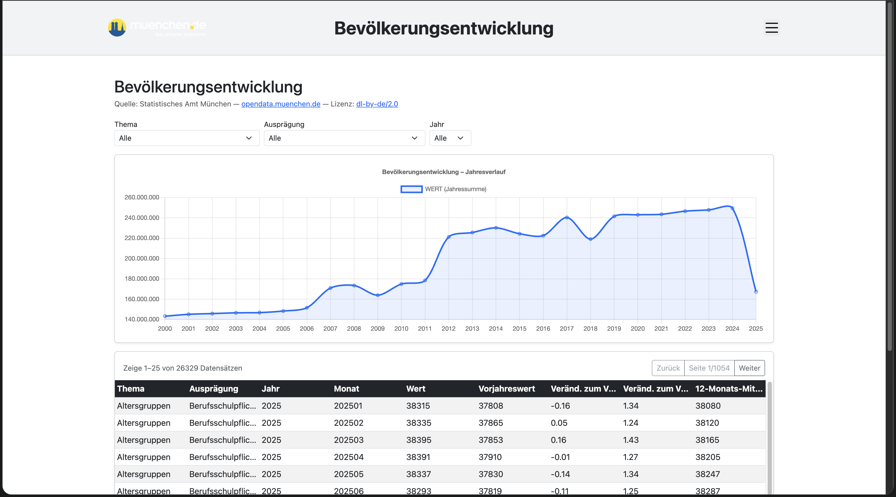
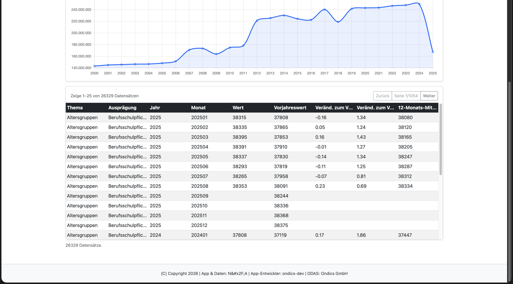

# Bevölkerungsentwicklung - App für den Open Data App-Store (ODAS)

Interaktive Visualisierung von Monatszahlen zur Bevölkerung für den [Open Data App Store](https://open-data-app-store.de/). Entspricht der [Open Data App-Spezifikation](https://open-data-apps.github.io/open-data-app-docs/open-data-app-spezifikation/). Mehr unter https://github.com/open-data-apps

---

## Funktionen





Single Page Application mit Logo, Menü, Impressum/Datenschutz/Kontakt-Seiten und Fußzeile. Die Konfiguration wird vom ODAS geladen. Inhalte:

- Filter nach Thema (`MONATSZAHL`), Ausprägung (`AUSPRAEGUNG`) und Jahr (`JAHR`)
- Tabellarische Anzeige der CKAN-Datensätze (max. 500 Zeilen in der Tabelle)
- Linienchart mit Jahressummen für `WERT`
- Robuster Datenabruf über lokalen Proxy-Endpunkt `/odp-data`

---

## Datenformat

Unterstützt CKAN Datastore JSON (API `datastore_search`, inkl. `resource_id`).

---

## Kompatible Datensätze

Datensätze mit folgenden Kernfeldern (weitere Felder sind zulässig):

| Feldname      | Beschreibung                       |
| ------------- | ---------------------------------- |
| `MONATSZAHL`  | Thema/Kategorie                    |
| `AUSPRAEGUNG` | Ausprägung innerhalb der Kategorie |
| `JAHR`        | Jahr der Beobachtung               |
| `WERT`        | Numerischer Wert (für Chart-Summe) |

---

## Entwicklung

**Voraussetzungen:** Docker / Docker Compose, Make

```bash
make build up
```

App läuft auf http://localhost:8089 (Konfiguration wird lokal geladen).

### Wichtige Dateien

| Datei                      | Beschreibung                                                                  |
| -------------------------- | ----------------------------------------------------------------------------- |
| `app/app.js`               | Hauptlogik: Proxy-Load, Filter, Tabellenrendering und Chart.js-Visualisierung |
| `app-package.json`         | App-Metadaten und Instanz-Konfigurationsfelder für den ODAS                   |
| `odas-config/config.json`  | Lokale Konfiguration für die Entwicklung                                      |
| `assets/odas-app-icon.svg` | App-Icon                                                                      |

---

## Konfiguration (Instanz)

| Parameter     | Beschreibung                                                            | Pflicht |
| ------------- | ----------------------------------------------------------------------- | ------- |
| `apiurl`      | CKAN Datastore-URL (inkl. `resource_id`), wird über `/odp-data` geladen | ja      |
| `urlDaten`    | URL zur Datensatzseite im Open Data Portal                              | ja      |
| `titel`       | Anzeigetitel im Inhaltsbereich                                          | ja      |
| `seitentitel` | Browser-Tab-Titel                                                       | ja      |
| `icon`        | App-Icon in der Kopfzeile                                               | ja      |
| `sprache`     | Sprache der App (aktuell `de`)                                          | ja      |

---

## Betriebsarten

Die App kann lokal, eigenstaendig hinter einem Traefik-Reverse-Proxy oder ueber den ODAS
betrieben werden.

**Standalone ist eingeschraenkt** und nur mit einer ausgetauschten, CORS-freigegebenen
Datenquelle moeglich — siehe den Hinweis unter „Standalone-Betrieb".

### Datenabruf: `proxyAktiv`

| Wert   | Bedeutung                                                                   |
| ------ | --------------------------------------------------------------------------- |
| `nein` | Direkter Abruf der Daten-URL. Setzt eine CORS-freigegebene Quelle voraus.    |
| `ja`   | Abruf ueber den ODAS-Proxy `…/odp-data`. Nur im ODAS-Live-System verfuegbar. |

**Diese App ist auf `ja` voreingestellt.** Die konfigurierte Datenquelle
(`opendata.muenchen.de`) sendet keinen `Access-Control-Allow-Origin`-Header; ein Direktabruf aus
dem Browser wird daher blockiert. Fuer Entwicklung und Standalone-Betrieb muss
eine CORS-freigegebene Datenquelle konfiguriert und `proxyAktiv` auf `nein`
gesetzt werden.

### Standalone-Betrieb

> **Standalone ist bei dieser App eingeschraenkt.** Mit der mitgelieferten Datenquelle
> ist sie in **keiner** Standalone-Konfiguration funktionsfaehig: mit `proxyAktiv: "ja"`
> fehlt der Proxy im Container, mit `"nein"` greift die CORS-Sperre der Quelle. Der
> Standalone-Betrieb setzt deshalb zwingend eine ausgetauschte, CORS-freigegebene
> Datenquelle voraus.

Voraussetzung: ein laufender Traefik mit dem externen Docker-Netzwerk `proxynet`,
dem EntryPoint `websecure` und dem Zertifikatsresolver `letsencrypt`.

1. In `docker-compose.standalone.yml` den Platzhalter `app1.example.com` durch den
   echten FQDN ersetzen.
2. In `odas-config/config.json` `proxyAktiv` auf `nein` **setzen** — ausgeliefert
   wird `ja`. Der ODAS-Proxy `…/odp-data` steht im Standalone-Container nicht zur
   Verfuegung; die mitgelieferte `nginx.conf` kennt keinen entsprechenden
   `location`-Block.
3. Die Datenquelle (`apiurl`) auf eine CORS-freigegebene Ressource umstellen. Die
   mitgelieferte Quelle (`opendata.muenchen.de`) sendet keinen
   `Access-Control-Allow-Origin`-Header und ist standalone **nicht** nutzbar.
4. Starten:

```bash
STANDALONE=true make up
STANDALONE=true make logs
STANDALONE=true make down
```

Im Standalone-Betrieb entfaellt die lokale Portfreigabe; Traefik terminiert TLS und
leitet auf den internen Nginx-Port 80 weiter. Die Konfiguration wird aus derselben
`odas-config/config.json` gelesen wie in der Entwicklung und von Nginx unter `/config`
ausgeliefert.

### Beim Aufruf kontaktierte Drittanbieter

Beim Aufruf dieser App werden folgende externe Server kontaktiert:

- `cdn.jsdelivr.net` — Bootstrap (Layout- und UI-Framework), Chart.js (Diagramme)

Diese Anbieter bleiben auch im Standalone-Betrieb extern; ein vollständig autarker Betrieb ohne Internetzugang ist derzeit nicht möglich (siehe F-07 in `Review.md`).

### Auslieferung an den ODAS

`make zip` erzeugt das Liefer-ZIP mit `app/`, `assets/`, `app-package.json` und
`CHANGELOG.md`. Die Infrastrukturdateien (`Dockerfile`, `docker-compose*.yml`,
`nginx.conf`, `Makefile`) sind nicht Teil der Auslieferung.

## Autor

© 2026, Ondics GmbH
